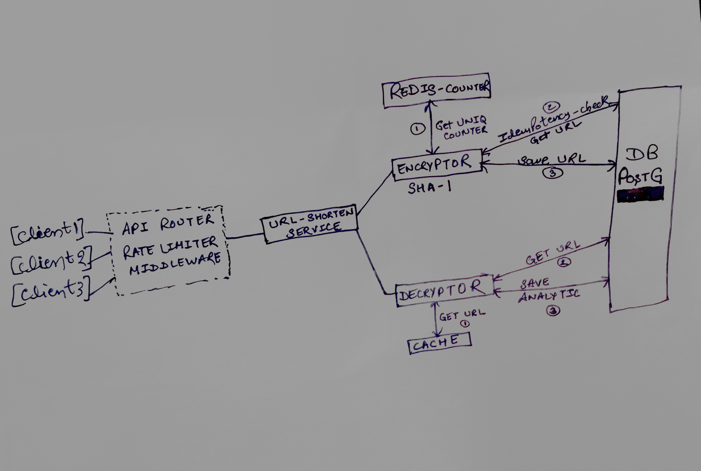

# encryption-service
This service is responsible for short url generation and serving redirect urls.

------------------------
Setup and Run -
1. Clone Repo 
2. Go to project root directory 
3. Run `docker compose up` 
4. Hit below-mentioned cURLs in postman

------------------------
API Documentation - 

/* Create Short URL API */

Endpoint : 
POST /url-shortener/v1
Description : 
Takes a long URL and returns a shortened (or encrypted) version.
If is_custom_url is true, a user-defined alias (custom_alias) will be used as the short code.

Sample Request Body :
{
    "long_url" : "www.gagan11.com",   // specifies url that needs to shortened
    "is_custom_url" : true,           // tell if custom alias is required
    "custom_alias" : "hello"          // custom alias if required
}
Sample Response Body :
{
    "success": true,
    "data": {
        "short_url": "http://localhost:8080/hello"
    }
}

Sample cURLs :
case : When custom alias is required
curl --location 'http://localhost:8080/url-shortener/v1' \
--header 'Content-Type: application/json' \
--data '{
    "long_url": "www.gagan11.com",
    "is_custom_url": true,
    "custom_alias": "hello"
}'

case : when custom alias is not required
curl --location 'http://localhost:8080/url-shortener/v1' \
--header 'Content-Type: application/json' \
--data '{
    "long_url" : "www.gagan11.com",
    "is_custom_url" : false
}'

/* Get Redirect URL API */
Endpoint :
GET /{short-url}
Description :
Fetches the original long URL corresponding to the given short code.
If the URL exists, the service can return the long URL in JSON.

Sample Request Body : NA

Sample Response Body :
{
    "success": true,
    "data": {
        "long_url": "www.gagan11.com"
    }
}

Sample cURL :
curl --location 'http://localhost:8080/356a192b7'

/* Get URL List API */
Endpoint :
GET /url-shortener/v1?page_size=10&cursor=0&order_by=created_at&order_type=desc
Description :
Fetches URL mappings list for admin use

Sample Request Body : NA

Sample Response Body :
{
    "success": true,
    "data": {
    "url_list": [
            {
                "id": 2,
                "short_code": "ac3478d69",
                "long_url": "www.gagan15.com",
                "last_accessed_at": "2025-11-10T22:39:26.9569+05:30",
                "click_count": 2,
                "is_custom_url": false
            },
            {
                "id": 1,
                "short_code": "hello",
                "long_url": "www.gagan11.com",
                "last_accessed_at": "2025-11-10T16:53:05.669601+05:30",
                "click_count": 1,
                "is_custom_url": true
            }
        ]
    }
}

-----------------------
Architecture Design:

---------------------
Design Decisions :
1. Postgres as time series DB for each date analytics
2. Cron to handle url expiry, will be run daily 3AM in the morning
3. Write rate limit per ip per day: 10
4. Read rate limit per ip per day: 500
5. Redis cache memory : 50MB to handle sufficient read traffic more than 10k per day
6. SHA-1 as encryptor algorithm
7. Max-retry for collisions - 3
8. Rate limit algo - Token bucket
9. DDD pattern for code structure

--------------------
Design Trade-Offs : 
1. Redis being single point of failure as we heavily rely on redis unique counter.
We can have zookeeper to handle url uniqueness if impact of downtime is costly. 
2. We have encryptor and decrypt on single instance.
we can segregate these two logic in separate services as traffic would be different for both of the use-cases.
3. Analytics should be saved on time series db like influx db but here we have saved in same url db for simplicity.
